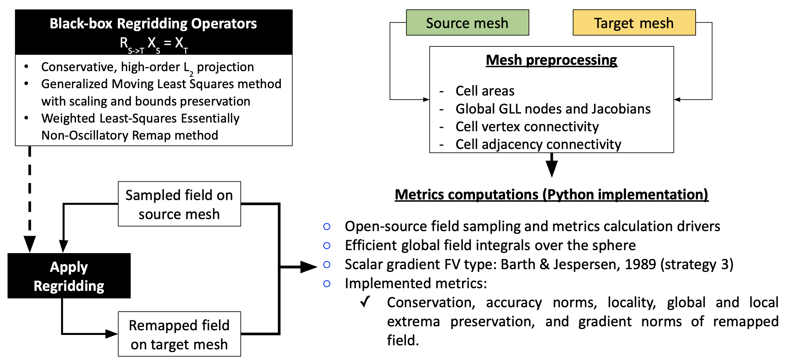

# Coupling Approaches for Next-Generation Architectures (CANGA) -- Remapping Offline-Online (ROO) Intercomparison Package

Strongly coupled nonlinear phenomena such as those described by Earth System Models (ESM) are composed of multiple component models with independent mesh topologies and scalable numerical solvers. A common operation in ESM is to remap or interpolate results from one component's numerical mesh to another, e.g., from the atmosphere to the ocean, during the temporal integration of the coupled system. Several remapping schemes are currently in use or available for ESM. However, a unified approach to compare the properties of these different schemes has not been attempted previously. 

We present a rigorous methodology for the evaluation and intercomparison of remapping methods through an independently implemented suite of metrics that measure the ability of a method to adhere to constraints such as grid independence, monotonicity, global conservation, and local extrema or feature preservation. A comprehensive set of numerical evaluations can be conducted based on a progression of scalar fields from idealized and smooth to more general climate data with strong discontinuities and strict bounds. 

This repository contains the Python drivers for the CANGA-ROO intercomparison study, which provide the infrastructure for enabling the computation of metrics for different remapping algorithms of interest in ESM.



## Dependencies

The third-party dependencies for running the drivers and generating plots of the remapping algorithm comparison are listed below.

  - pyshtools>=4.2
  - scipy>=1.0.1
  - plotly>=4.0.0
  - pandas>=0.23.0
  - matplotlib>=2.2.0
  - netCDF4>=1.4.0
  - rasterio>=1.0.0
  - numba>=0.48.0

Users with Python3 can directly use `pip` in a clean environment to get started.
```
$ pip install -r requirements.txt
```

You can also install the dependencies using [setuptools](https://packaging.python.org/key_projects/#setuptools).
```
$ python setup.py install
```

## Intercomparison Workflow Example

There are three main drivers available in the source directory.
  1) Mesh preprocessing driver file: src/CANGAMeshPreprocessDriver.py
  2) Field generator driver file: src/CANGAFieldGenerator.py
  3) Metrics driver file: src/CANGAMetricsDriver.py

An example test problem generation sequence is shown below.

1) Generate the mesh files for the test problem
   - Create a source (say of Cubed-Sphere type) mesh file for a particular resolution eg., "outCS128.g"
   - Create a target (say of Icosahedral-Dual polygonal type) mesh file for a particular resolution eg., "outICOD128.g"
   - These two files do not need to have consistent format since they will be pre-processed independently. And so arbitrary mesh types and resolutions can be used to create new test problems as necessary.
   
2) Preprocess the source and target meshes
   ```
   python CANGAMeshPreprocessDriver.py --mesh outCS128.g --ExodusSingleConn --SpectralElement
   python CANGAMeshPreprocessDriver.py --mesh outICOD128.g --ExodusSingleConn
   ```
   - This will write the two variables varCoord (Cartesian coordinates of global nodes where the field is evaluated i.e. cell centers in the FV case or GLL nodes in the FE case) and varCon (Global connectivity list for cells/elements) to the respective mesh file.
   - The --SpectralElement option only applies to quadrilaterals (code will check and abort otherwise) and generates augmented global DOF coordinates and connectivity.  
     It also generates the global Jacobian weights for each global DOF. This facilitates integrals through the susequent metrics computations.

   The processed mesh output:
   - Augmented source mesh file: `"outCS128_enhanced.g"`
   - Augmented target mesh file: `"outICOD128_enhanced.g"`

3) To generate sampled data on a pre-processed mesh file, the following commands can be used.
   - To output the cell averaged sampling of all five pre-defined fields, using a 6th order quadrature rule for example on a NE60 (CS) mesh, run
       `python CANGAFieldGenDriver.py --pm outCS128_enhanced.g --so 6 --nm 512 --evaluateAllFields --ExodusSingleConn`
     In general, care should be taken to ensure the quadrature order is sufficient enough to compute the cell integrals precisely to some user tolerance.

   - To generate the sampled files on the global GLL nodes without any quadrature rule (`--so` option is ignored), run
       `python CANGAFieldGenDriver.py --pm outCS128_enhanced.g --so 6 --nm 512 --evaluateAllFields --ExodusSingleConn --SpectralElement`

   Notes
     - The maximum number of SPH order is 768, which is based on expansions of satellite data that yield ~1000+ modes for Total Precipitable Water, Cloud Fraction, and Topography.
     - Running the CANGAFieldGenDriver.py will generate *new* mesh files with the prefix `testdata_', and suffix ``A1_A2_TPW_CFR_TPO'` to indicate the fields defined (typically when `--evaluateAllFields` is used).
     Note that individual fields can also be sampled with `--EvaluateA1, --EvaluateA2, --EvaluateTPW, --EvaluateCFR, --EvaluateTPO` options, which will determine the output suffix accordingly.
     - Using the example above, the following NetCDF4 files are created in the workflow: `testdata_outCS128_A1_A2_TPW_CFR_TPO.nc` AND `testdata_outICOD128_A1_A2_TPW_CFR_TPO.nc`
     - The new data files are augmented copies of the original mesh data files keeping all metadata consistent.
   
4) Next, use your favorite remapper implementation to compute the projections of the fields from the source mesh to the target mesh. This may involve compute $L^2$-minimization based remapping weights, or 
   using Bilinear, RBF, GMLS or WLS-ENOR reconstruction techniques. Irrespective of the method used, the workflow remains the same as the comparison infrastructure considers the remapper as a black-box for
   all practical purposes. 
   - Input: source and target mesh files that are pre-processed, and contain the sampled reference fields
   - Output: the solution projected from source to target (one-way), and back from target to source (two-way), or cyclic remapping (for say N=1000 iterations)

   As an example, to test the remap workflow using TempestRemap, the testdata files generated in Step (2) can be used as follows:
   - Generate the overlap or intersection mesh
      `$TEMPESTREMAP_DIR/GenerateOverlapMesh --a outCS128_enhanced.g --b outICOD128_enhanced.g --out CS128_ICOD128_overlap.g`
   - Next generate the remapping weights; `--in_np` argument controls the order of reconstruction
      `$TEMPESTREMAP_DIR/GenerateOfflineMap --in_mesh outCS128_enhanced.g --out_mesh outICOD128_enhanced.g --ov_mesh CS128_ICOD128_overlap.g --in_np 2 --out_map CS128_ICOD128_O2_A1_A2_TPW_CFR_TPO.nc`
   - Next apply the remapping weights on the solution defined on source mesh to compute projection on target mesh
      `$TEMPESTREMAP_DIR/ApplyOfflineMap --map CS128_ICOD128_O2_A1_A2_TPW_CFR_TPO.nc --var TotalPrecipWater --in_data testdata_outCS128_A1_A2_TPW_CFR_TPO.nc --out_data projTestdata_outICOD128_A1_A2_TPW_CFR_TPO.nc`
   - The above steps can be repeated multiple times for example by switching source and target meshes and using the appropriate weights file to compute projections. Typically this workflow can be driven through
     a higher level Python script to store the field data vectors in a NetCDF4 file for faster processing later when computing metrics.

5) Consider now that the projection of the fields are available in say `projTestdata_outICOD128_A1_A2_TPW_CFR_TPO.nc`. We can now compare this against the reference data already available in `testdata_outICOD128_A1_A2_TPW_CFR_TPO.nc` 
   file to generate all the remapping metrics of interest.
   - You now have the 3 essential files: 
      - Field sampled on the source mesh: `testdata_outCS128_A1_A2_TPW_CFR_TPO.nc`
      - Field sampled on the target mesh: `testdata_outICOD128_A1_A2_TPW_CFR_TPO.nc`
      - Field remapped from source to target mesh: `projTestdata_outICOD128_A1_A2_TPW_CFR_TPO.nc`

   - The `CANGAMetricsDriver.py` driver can now be used to generate all the relevant remapping metrics data needed to perform comparison of algorithns.
      `python CANGAMetricsDriver.py --ss testdata_outCS128_A1_A2_TPW_CFR_TPO.nc --st testdata_outICOD128_A1_A2_TPW_CFR_TPO.nc --data projTestdata_outICOD128_A1_A2_TPW_CFR_TPO.nc --includeGradientMetrics \
          --dimension 2 --field TotalPrecipWater,CloudFraction,Topography,AnalyticalFun1,AnalyticalFun2 --output metrics_CS128_ICOD128_O2.csv`
   
   Notes
    - The `--dimension` option refers to the number of remapping iterations to be used in metrics calculation. Index 1 refers to the original reference data on the meshes.
    - The output file will be suffixed appropriately depending on the field for which the metrics are being computed
    - The `--includeGradientMetrics` is not ON by default. You need to specify that if gradient metrics are needed in the output metrics file. Note that due to computation of convex hulls and Kd-tree datastructures,
      typically enabling this option can lead to a considerable slow down in the first metrics computation iteration. However, the necessary structures are cached and then reused in subsequent remap cycle calculations.

6) When the metrics driver completes, the metrics output file for the AnalyticalFun1 variable: `metrics_CS128_ICOD128_O2_AnalyticalFun1.csv`, will contain output similar to the following data. 
   A sample result set for CS128 and ICOD128 for 100 cyclic remapping iterations (with output every 10 iterations) yields the following:

|    GC   |  GL1  |  GL2  | GLinf | GMaxE | GMinE  |LMaxL1 |LMaxL2 |LMaxLm |LMinL1  |LMinL2 |LMinLm| H12T  |  H1T  | H12S  |  H1S  |
|---------|-------|-------|-------|-------|--------|-------|-------|-------|--------|-------|------|-------|-------|-------|-------|
|-1.23E-16| 0.00  | 0.00  | 0.00  | 0.00  | 0.00   | 0.00  | 0.00  | 0.00  | 0.00   | 0.00  |0.00E0| 0.00  | 0.00  | 0.00  | 0.00  |
|-5.44E-10|1.48E-5|1.58E-5|3.09E-5|8.10E-6|-8.10E-6|7.41E-6|1.12E-5|1.54E-5|-7.41E-6|1.12E-5|0.00E0|1.12E-3|1.12E-3|4.60E-4|4.60E-4|
| 1.56E-10|2.42E-5|2.69E-5|9.29E-5|1.31E-5|-1.31E-5|1.21E-5|1.90E-5|4.64E-5|-1.21E-5|1.89E-5|0.00E0|2.49E-3|2.49E-3|1.74E-3|1.74E-3|
| 1.89E-9 |2.86E-5|3.26E-5|1.17E-4|1.77E-5|-1.77E-5|1.43E-5|2.30E-5|5.87E-5|-1.43E-5|2.29E-5|0.00E0|3.01E-3|3.01E-3|2.28E-3|2.28E-3|
| 3.64E-9 |3.22E-5|3.74E-5|1.31E-4|2.13E-5|-2.13E-5|1.61E-5|2.64E-5|6.57E-5|-1.61E-5|2.64E-5|0.00E0|3.37E-3|3.37E-3|2.66E-3|2.66E-3|
| 5.35E-9 |3.52E-5|4.19E-5|1.53E-4|2.40E-5|-2.40E-5|1.76E-5|2.95E-5|7.64E-5|-1.76E-5|2.95E-5|0.00E0|3.65E-3|3.65E-3|2.96E-3|2.96E-3|
| 7.01E-9 |3.80E-5|4.60E-5|1.72E-4|2.59E-5|-2.60E-5|1.90E-5|3.25E-5|8.58E-5|-1.90E-5|3.25E-5|0.00E0|3.90E-3|3.90E-3|3.21E-3|3.21E-3|
| 8.63E-9 |4.06E-5|4.99E-5|1.88E-4|2.74E-5|-2.74E-5|2.03E-5|3.52E-5|9.42E-5|-2.03E-5|3.53E-5|0.00E0|4.11E-3|4.11E-3|3.44E-3|3.44E-3|
| 1.02E-8 |4.30E-5|5.36E-5|2.04E-4|2.85E-5|-2.85E-5|2.15E-5|3.78E-5|1.02E-4|-2.15E-5|3.79E-5|0.00E0|4.30E-3|4.30E-3|3.64E-3|3.64E-3|


## Driver Assumptions 

Some primary assumptions in the driver are,

  1) Non-coincident grid array from mesh file
  2) Non-coincident, convex, element connectivity array from mesh file or automatically generated for SCRIP formatted mesh files
  3) Main variable is defined at cell centroids (FV to FV mappings) or at element GLL nodes (FV to SE or SE to FV mappings) for regular quadrilateral elements ONLY
  4) Gradient metric is implemented using a linear reconstruction of one ring of adjacent cells (strategy 6 from Barth & Jesperson, 1989) or by direct local differentiation per element at GLL nodes.
  5) The metric calculations use data vectors defined on the source and target meshes, which are typically stored in an external NetCDF4 file. The `loadDataField` routine in `CANGAMetricsDriver.py` can be modified to read the correct variable needed.

## Bugs, Correspondence, Contributing

The remapping intercomparison code is distributed under a 3-clause BSD licensing agreement. [](https://opensource.org/licenses/BSD-3-Clause)

If you have questions, comments or suggestions in using the CANGA-ROO intercomparison code, please contact the researchers through official email. You can also use the issues page in Github to start conversations.

If you would like to contribute to the package, please submit a merge request with detailed information on the purpose and need for the new changes.

